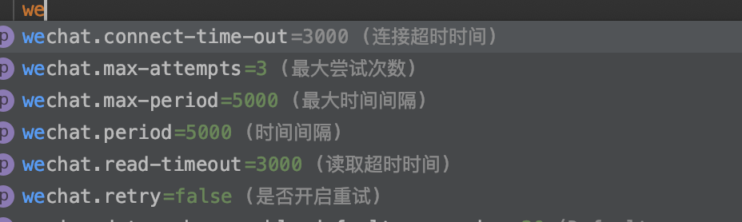

## damon-enterprise-wechat
### 基于feign封装企业微信服务端API

### 实现功能
>> 授权
>
>> 获取企业部门
>
>> 获取部门用户
>

### 待实现功能
>> 接口丰富
>

### 使用方法
* step1 基于spring initializr创建spring boot工程,添加依赖
````$xslt
    <dependency>
        <groupId>org.springframework.boot</groupId>
        <artifactId>spring-boot-starter-web</artifactId>
    </dependency>

    <dependency>
        <groupId>com.damon</groupId>
        <artifactId>damon-enterprise-wechat</artifactId>
        <version>1.0-SNAPSHOT</version>
    </dependency>

````
* step2 配置
```$xslt
wechat.url=https://qyapi.weixin.qq.com/cgi-bin  //企业微信服务端调用地址
wechat.corp-id=xxx
wechat.corp-secret=xxxxxxxxx
wechat.token-expires=7000   //access_token有效时长，必须小于expires_in
```
>> 其他连接配置

>>

* step3 使用
```$xslt
    @Resource
    private DepartmentService departmentService;

    @Resource
    private UserService  userService;


    @GetMapping("/departments")
    public List<Department> departmentList(){
        return departmentService.listAllDepartment();
    }


    @GetMapping("/users")
    public List<User>  users(@RequestParam("departmentId") Integer departmentId){
        return userService.listUserByDepartment(departmentId,Boolean.TRUE);
    }
```